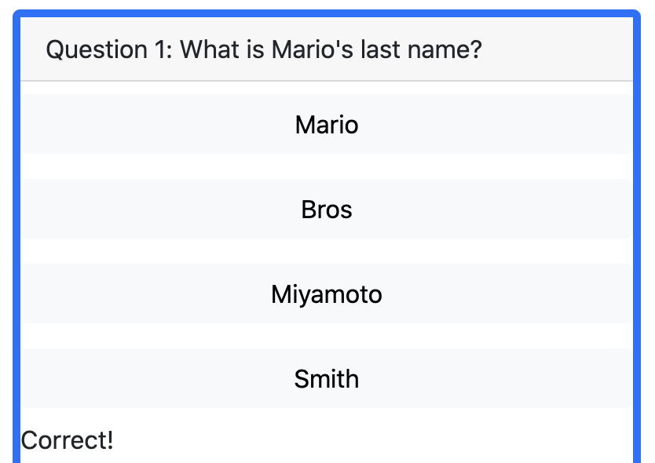
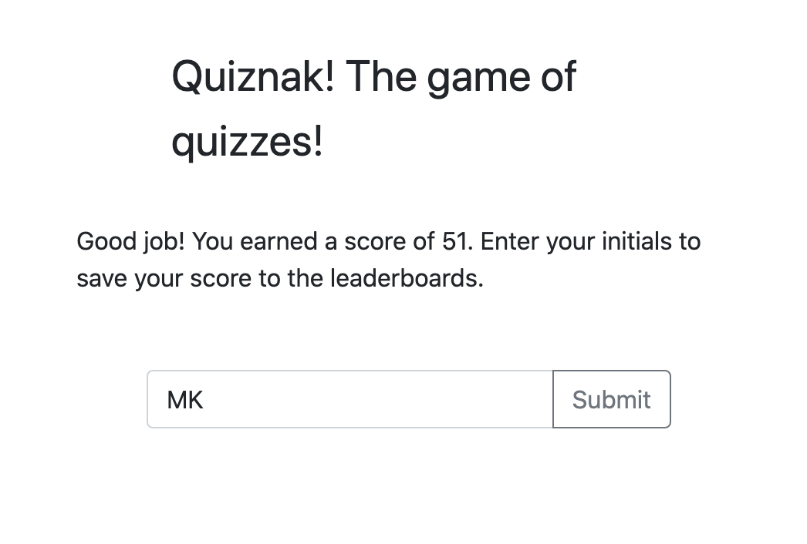
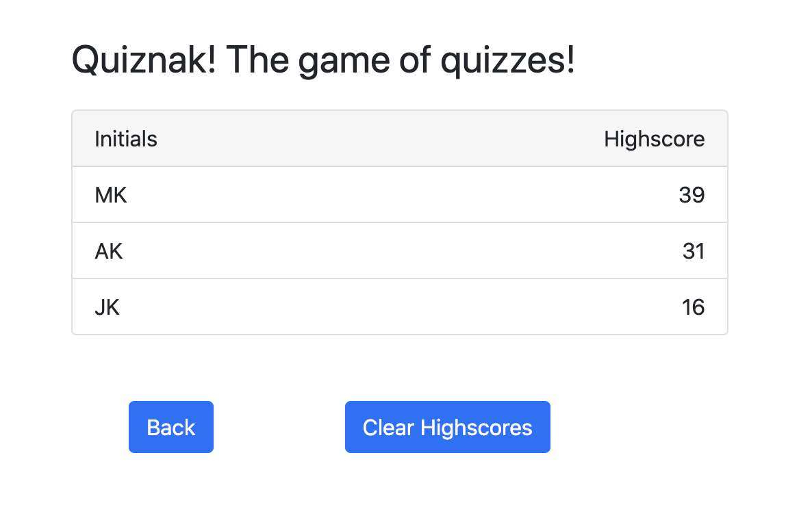

# Code Quiz

fun text

-----------------------
## Table of Contents
1. [Description](#description)
2. [Deployed Link](#deployed-link)
3. [Walkthrough](#walkthrough)
4. [Code Snippet](#code-snippet)
5. [Prerequisites](#prerequisites)
6. [Installing Instructions](#installing-instructions)
7. [Built with](#built-with)
8. [Licenses](#licenses)
9. [Author](#author)
10. [Acknowledgements](#acknowledgements)

-----------------------
## Description
A timed multiple choice quiz. This fun application runs in the browers and features dynamically updated HTML and CSS powered by Javascript. It has a responsive UI, adapting to multiple screen sizes and utilizes the client side storage to keep a record of scores

-----------------------
## Deployed Link
https://akhalid88.github.io/quiznak-game/

-----------------------
## Walkthrough

Loading the webpage brings the player to this landing page with the option to view Highscores in the top left and start the quiz game in the blue button.

Upon clicking the Start Quiz button, the player is given a series of mutliple choice questions that they must answer before the timer in the upper right of the window runs out.

Each question has 4 possible choices, with only 1 correct answer. The user is informed upon selection of their answer whether they got it right or wrong in the form of a toolttip at the bottom of the question area.


Getting an incorrect answer will deduct 10 seconds from the timer. Then when either the timer reaches 0 or the the player has run out of questions, the game will be over and they will be presented with the game over screen. 



Here they can enter their initials and submit their score to the Highscore leaderboard



The scoreboard can also be viewed from selecting the View Highscores link in the top left of the screen. From here the player can either go back or clear the Highscores list. 

-----------------------
## Code Snippet
THe quiz questions are stored as an array of objects with a nested object of answers that feed the button generation in the quiz.
```
var quizArray = [
  { question: "Question 1: What is Mario's last name?",
    correctAnswer: "optionA",
    answers: {
      optionA: "Mario", //Correct
      optionB: "Bros",
      optionC: "Miyamoto",
      optionD: "Smith"
    }
  }, ...
```

The quiz questions are loaded to the screen using the following code. the text content of the question and button options are loaded in by targeting the quizArray at the index of the current 'question' and then either .question or .answers.option to get to the specific option. This function called at the beginning of the game to load the first question and subsequently as the user answers each previous question.
```
function loadNextQuestion(question) {
  questionEl.textContent = quizArray[question].question;
  aBtn.textContent = quizArray[question].answers.optionA;
  bBtn.textContent = quizArray[question].answers.optionB;
  cBtn.textContent = quizArray[question].answers.optionC;
  dBtn.textContent = quizArray[question].answers.optionD;
  incorrectEl.classList.add('hide');
  correctEl.classList.add('hide');
}
```

For the highscores functionality I created two functions, 1 to set the player name and score to the local storage and one to get the player data from local storage. The data needs the JSON.stringify and JSON.parse tool respectivley to be able to properly write to and read from the local storage as the local storage only accepts string values.
```
function setToLocal(array) {
  localStorage.setItem("players", JSON.stringify(array));
}

function getFromLocal() {
  players = JSON.parse(localStorage.getItem("players"));
  return players;
}
```

THe below code illustrates how the highscores are written to the leaderboard. After calling the getFromLocal() function, we iterate through the array of players and for each player we create a list element assigning it the players name, and we create a span element assigning it the players score. We then append the span element to the list element. And finally once our list entry is completed we append it to the highscore list.
```
for (var i = 0; i < players.length; i++) {
    var player = players[i];

    var li = document.createElement("li");
    li.textContent = player.username;
    li.setAttribute("class", "list-group-item listitem-" + i);
    
    var span = document.createElement("span");
    span.textContent = player.userscore;
    span.setAttribute("class", "float-end");

    li.appendChild(span);
    hsListEl.appendChild(li);
  }
```


-----------------------
## Prerequisites
A computer with an active internet connection and a web browser

-----------------------
## Installing instructions
None

-----------------------
## Built with
- Javascript
- Bootstrap
- HTML
- CSS
- Git
- Github

-----------------------
## Licenses
This Project is licensed under MIT license

-----------------------
## Author

[LinkedIn](https://www.linkedin.com/in/abdullahkhalid/)
<br>
[GitHub](https://github.com/akhalid88)

-----------------------
## Acknowledgements
- Jerome Chenette (Instructor)
- Manuel Nunes (TA)
- Mahisha Manikandan (TA)
- UC Berkeley Coding Bootcamp