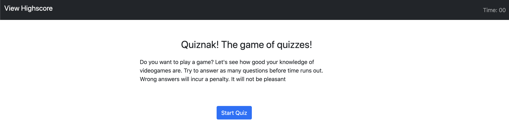

# Code Quiz

fun text

-----------------------
## Table of Contents
1. [Description](#description)
2. [Deployed Link](#deployed-link)
3. [Walkthrough](#walkthrough)
4. [Code Snippet](#code-snippet)
5. [Prerequisites](#prerequisites)
6. [Installing Instructions](#installing-instructions)
7. [Built with](#built-with)
8. [Licenses](#licenses)
9. [Author](#author)
10. [Acknowledgements](#acknowledgements)

-----------------------
## Description
A timed multiple choice quiz. This fun application runs in the browers and features dynamically updated HTML and CSS powered by Javascript. It has a responsive UI, adapting to multiple screen sizes and utilizes the client side storage to keep a record of scores

-----------------------
## Deployed Link
https://akhalid88.github.io/quiznak-game/

-----------------------
## Walkthrough

-----------------------
## Code Snippet

-----------------------
## Prerequisites
A computer with an active internet connection and a web browser

-----------------------
## Installing instructions
None

-----------------------
## Built with
- Javascript
- Bootstrap
- HTML
- CSS
- Git
- Github

-----------------------
## Licenses
This Project is licensed under MIT license

-----------------------
## Author

[LinkedIn](https://www.linkedin.com/in/abdullahkhalid/)
 
[GitHub](https://github.com/akhalid88)

-----------------------
## Acknowledgements
- Jerome Chenette (Instructor)
- Manuel Nunes (TA)
- Mahisha Manikandan (TA)
- UC Berkeley Coding Bootcamp